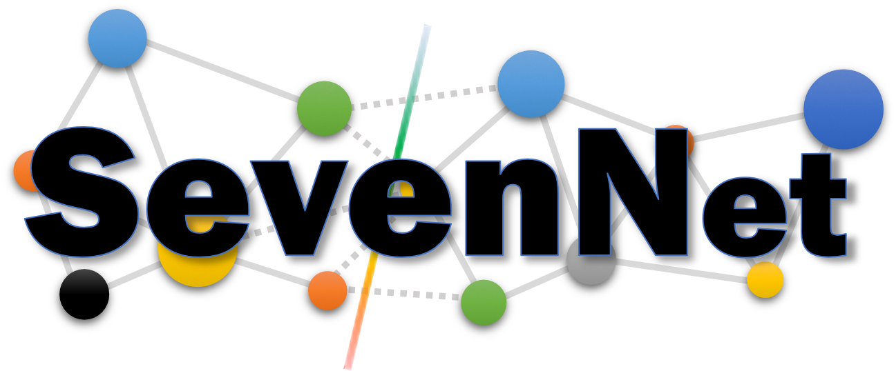

# SevenNet

SevenNet (Scalable EquiVariance Enabled Neural Network) is a graph neural network interatomic potential package that supports parallel molecular dynamics simulations with [`LAMMPS`](https://docs.lammps.org/Manual.html). Its underlying GNN model is based on [`nequip`](https://github.com/mir-group/nequip).

The project provides parallel molecular dynamics simulations using graph neural network interatomic potentials, which enable large-scale MD simulations or faster MD simulations.

The installation and usage of SevenNet are split into two parts: training + command-line interface + ASE calculator (handled by Python) and molecular dynamics (handled by [`LAMMPS`](https://docs.lammps.org/Manual.html)).

**PLEASE NOTE:** SevenNet+LAMMPS parallel after this commit: 14851ef (v0.9.3 ~ 0.9.5) has a serious bug:
it gives wrong forces when the number of mpi processes is greater than two. The corresponding pip version is yanked for this reason. The bug is fixed for the main branch, from v0.10.x, and pip (PyPI: v0.9.3.post0).


## Features
 - Pre-trained GNN interatomic potential SevenNet-0, with fine-tuning interface
 - ASE calculator support
 - Multi-GPU accelerated molecular dynamics with LAMMPS
 - Accelerated D3 (van der Waals) dispersion, written in CUDA.

Supporting MD frameworks and its features. While all modes support both CPU and GPU, GPU is much faster.
| Features        | ASE calculator   | LAMMPS serial   | LAMMPS parallel |
|-----------------|------------------|-----------------|-----------------|
| Working?        | ✅ | ✅ | ✅ |
| Multi-GPU       | ❌ | ❌ | ✅ |
| Stress          | ✅ | ✅ | ✅ |
| D3 correction   | ⏳ | ✅ | ⏳ |

✅: Support, ⏳: Planned, ❌: Not planned.


## Contents
- [SevenNet](#sevennet)
  - [Installation](#installation)
  - [Usage](#usage)
    - [SevenNet-0](#sevennet-0)
    - [SevenNet Calculator for ASE](#sevennet-calculator-for-ase)
    - [Training sevenn](#training)
      - [Multi-GPU training](#multi-gpu-training)
    - [sevenn_graph_build](#sevenn_graph_build)
    - [sevenn_inference](#sevenn_inference)
    - [sevenn_get_model](#sevenn_get_model)
  - [Installation for LAMMPS](#installation-for-lammps)
  - [Usage for LAMMPS](#usage-for-lammps)
    - [To check installation](#to-check-installation)
    - [For serial model](#for-serial-model)
    - [For parallel model](#for-parallel-model)
  - [Future Works](#future-works)
  - [Citation](#citation)

## Installation

- Python >= 3.8
- PyTorch >= 1.12.0, PyTorch < 2.5.0

Please install PyTorch from [`PyTorch official`](https://pytorch.org/get-started/locally/) before installing the SevenNet.
Note that for SevenNet, `torchvision` and `torchaudio` are redundant. You can safely exclude these packages from the installation commands.

Here are the recommended versions we've been using internally without any issues.

- PyTorch/2.2.2 + CUDA/12.1.0
- PyTorch/1.13.1 + CUDA/12.1.0
- PyTorch/1.12.0 + CUDA/11.6.2

Using the newer versions of CUDA with PyTorch is usually not a problem. For example, you can compile and use `PyTorch/1.13.1+cu117` with `CUDA/12.1.0`.

**PLEASE NOTE:** You must install PyTorch before installing SevenNet. They are not marked as dependencies since it is coupled with the CUDA version.

After the PyTorch installation, run

```bash
pip install sevenn
```

To download the latest version of SevenNet(not stable!), run
```bash
pip install https://github.com/MDIL-SNU/SevenNet.git
```
Note that we have CHANGELOG.md. As SevenNet is under active development (again), I recommend checking it for new features and changes.

## Usage

### SevenNet-0

SevenNet-0 is a general-purpose interatomic potential trained on the [`MPF dataset of M3GNet`](https://figshare.com/articles/dataset/MPF_2021_2_8/19470599) or [`MPtrj dataset of CHGNet`](https://figshare.com/articles/dataset/Materials_Project_Trjectory_MPtrj_Dataset/23713842).

While SevenNet-0 can be applied to downstream tasks as it is, it is recommended to [`fine-tune`](#training) SevenNet-0 before addressing real downstream tasks.

#### SevenNet-0 (11July2024)

This model was trained on [`MPtrj`](https://figshare.com/articles/dataset/Materials_Project_Trjectory_MPtrj_Dataset/23713842). We suggest starting with this model as we found that it performs better than the previous SevenNet-0 (22May2024). Check [`Matbench Discovery leaderborad`](https://matbench-discovery.materialsproject.org/) for this model's performance on materials discovery. For more information, click [here](sevenn/pretrained_potentials/SevenNet_0__11July2024).

Whenever the checkpoint path is the input, this model can be loaded via `7net-0 | SevenNet-0 | 7net-0_11July2024 | SevenNet-0_11July2024` keywords.

**Acknowledgments**: This work was supported by the Neural Processing Research Center program of Samsung Advanced Institute of Technology, Samsung Electronics Co., Ltd. The computations for training models were carried out using the Samsung SSC-21 cluster.

#### SevenNet-0 (22May2024)

This model was trained on [`MPF.2021.2.8`](https://figshare.com/articles/dataset/MPF_2021_2_8/19470599). This is the model used in [our paper](https://pubs.acs.org/doi/10.1021/acs.jctc.4c00190). For more information, click [here](sevenn/pretrained_potentials/SevenNet_0__22May2024).

Whenever the checkpoint path is the input, this model can be loaded via `7net-0_22May2024 | SevenNet-0_22May2024` keywords.

### SevenNet Calculator for ASE

[ASE (Atomic Simulation Environment)](https://wiki.fysik.dtu.dk/ase/) is a set of tools and Python modules for atomistic simulations. SevenNet-0 and SevenNet-trained potentials can be used with ASE for its use in python.

For pre-trained models,

```python
from sevenn.sevennet_calculator import SevenNetCalculator
sevennet_0_cal = SevenNetCalculator("7net-0", device='cpu')  # 7net-0, SevenNet-0, 7net-0_22May2024, 7net-0_11July2024 ...
```

For user trained models,

```python
from sevenn.sevennet_calculator import SevenNetCalculator
checkpoint_path = ### PATH TO CHECKPOINT ###
sevennet_cal = SevenNetCalculator(checkpoint_path, device='cpu')
```

### Training

```bash
sevenn_preset fine_tune > input.yaml
sevenn input.yaml -s
```

Other valid preset options are: `base`, `fine_tune`, and `sevennet-0`.
Check comments in the preset yaml files for explanations. For fine-tuning, note that most model hyperparameters cannot be modified unless explicitly indicated.

To reuse a preprocessed training set, you can specify `${dataset_name}.sevenn_data` to the `load_dataset_path:` in the `input.yaml`.

#### Multi-GPU training

We support multi-GPU training features using PyTorch DDP (distributed data parallel). We use one process (or a CPU core) per GPU.

```bash
torchrun --standalone --nnodes {number of nodes} --nproc_per_node {number of GPUs} --no_python sevenn input.yaml -d
```

Please note that `batch_size` in input.yaml indicates `batch_size` per GPU.

### sevenn_graph_build

```bash
sevenn_graph_build my_train_data.extxyz 5.0
```

You can preprocess the dataset with `sevenn_graph_build` to obtain `./sevenn_data/graph.pt` files. These files can be used for training (`sevenn`) or
inference (`sevenn_inference`), skipping the graph build stage. `./sevenn_data/graph.yaml` contains statistics and meta information for the dataset.
These files must be located under the `sevenn_data`. If you move the dataset, move the entire `sevenn_data` directory without changing the contents.

See `sevenn_graph_build --help` for more information.

### sevenn_inference

```bash
sevenn_inference checkpoint_best.pth path_to_my_structures/*
```

This will create dir `sevenn_infer_result`. It includes .csv files that enumerate prediction/reference results of energy and force.
See `sevenn_inference --help` for more information.

### sevenn_get_model

This command is for deploying lammps potentials from checkpoints. The argument is either the path to checkpoint or the name of pre-trained potential.

```bash
sevenn_get_model 7net-0
```

This will create `deployed_serial.pt`, which can be used as lammps potential under `e3gnn` pair_style.

The parallel model can be obtained in a similar way

```bash
sevenn_get_model 7net-0 -p
```

This will create a directory with multiple `deployed_parallel_*.pt` files. The directory path itself is an argument for the lammps script. Please do not modify or remove files under the directory.
These models can be used as lammps potential to run parallel MD simulations with GNN potential using multiple GPU cards.

## Installation for LAMMPS

- PyTorch < 2.5.0 (same version as used for training)
- LAMMPS version of 'stable_2Aug2023_update3' [`LAMMPS`](https://github.com/lammps/lammps)
- (Optional) [`CUDA-aware OpenMPI`](https://www.open-mpi.org/faq/?category=buildcuda) for parallel MD
- MKL-include


**PLEASE NOTE:** CUDA-aware OpenMPI does not support NVIDIA Gaming GPUs. Given that the software is closely tied to hardware specifications, please consult with your server administrator if unavailable.

**PLEASE NOTE:** Virial stress (pressure) outputs of SevenNet parallel should work correctly! I have validated it several times. However, I recommend testing it by comparing outputs between serial and parallel, as the code is not yet mature.

If your cluster supports the Intel MKL module (often included with Intel OneAPI, Intel Compiler, and other Intel-related modules), load the module. If it is unavailable, read the 'Note for MKL' section before running cmake.

CUDA-aware OpenMPI is optional but recommended for parallel MD. If it is not available, in parallel mode, GPUs will communicate via CPU. It is still faster than using only one GPU, but its efficiency is low.

Ensure the LAMMPS version (stable_2Aug2023_update3). You can easily switch the version using git. After switching the version, run `sevenn_patch_lammps` with the lammps directory path as an argument.

```bash
git clone https://github.com/lammps/lammps.git lammps_sevenn --branch stable_2Aug2023_update3 --depth=1
sevenn_patch_lammps ./lammps_sevenn {--d3}
```

**Add `--d3` option to install GPU accelerated [Grimme's D3 method](https://doi.org/10.1063/1.3382344) pair style (currently available in main branch only, not pip). For its usage and details, click [here](sevenn/pair_e3gnn).**

You can refer to `sevenn/pair_e3gnn/patch_lammps.sh` for the detailed patch process.

Build LAMMPS with cmake (example):

```bash
cd ./lammps_sevenn
mkdir build
cd build
cmake ../cmake -DCMAKE_PREFIX_PATH=`python -c 'import torch;print(torch.utils.cmake_prefix_path)'`
make -j4
```

If the compilation is successful, you will find the executable at `{path_to_lammps_dir}/build/lmp`. To use this binary easily, for example, create a soft link in your bin directory (which should be included in your `$PATH`).

```bash
ln -s {absolute_path_to_lammps_dir}/build/lmp $HOME/.local/bin/lmp
```

This will allow you to run the binary using `lmp -in my_lammps_script.lmp`.

### Note for MKL

You may encounter `MKL_INCLUDE_DIR NOT-FOUND` during cmake. This usually means the environment variable is not set correctly, or mkl-include is not present on your system.

Install mkl-include with:

```bash
conda install -c intel mkl-include
```

If you encounter an error, remove `-c intel`. This is a known bug in the recent Conda version.

Append the following to your cmake command:

```bash
-DMKL_INCLUDE_DIR=$CONDA_PREFIX/include
```

If you see hundreds of `undefined reference to XXX` errors with `libtorch_cpu.so` at the end of compilation, check your `$LD_LIBRARY_PATH`. PyTorch depends on MKL libraries (this is a default backend for torch+CPU), therefore you already have them. For example, if you installed PyTorch using Conda, you may find `libmkl_*.so` files under `$CONDA_PREFIX/lib`. Ensure that `$LD_LIBRARY_PATH` includes `$CONDA_PREFIX/lib`.

For other error cases, you might want to check [`pair-nequip`](https://github.com/mir-group/pair_nequip), as the `pair-nequip` and SevenNet+LAMMPS shares similar requirements: torch + LAMMPS.

## Usage for LAMMPS

### To check installation

```bash
{lammps_binary} -help | grep e3gnn
```

You will see `e3gnn` and `e3gnn/parallel` as pair_style.

### For serial model

```txt
units         metal
atom_style    atomic
pair_style e3gnn
pair_coeff * * {path to serial model} {space separated chemical species}
```

### For parallel model

```txt
units         metal
atom_style    atomic
pair_style e3gnn/parallel
pair_coeff * * {number of message-passing layers} {path to the directory containing parallel model} {space separated chemical species}
```

For example,

```txt
pair_style e3gnn/parallel
pair_coeff * * 4 ./deployed_parallel Hf O
```
The number of message-passing layers is equal to the number of `*.pt` files in the `./deployed_parallel` directory.

Use [sevenn_get_model](#sevenn_get_model) for deploying lammps models from checkpoint for both serial and parallel.

One GPU per MPI process is expected. The simulation may run inefficiently if the available GPUs are fewer than the MPI processes.

**PLEASE NOTE:** Currently, the parallel version raises an error when there are no atoms in one of the subdomain cells. This issue can be addressed using the `processors` command and, more optimally, the `fix balance` command in LAMMPS. This will be patched in the future.

## Future Works

- Notebook examples and improved interface for non-command line usage
- Development of a tiled communication style (also known as recursive coordinate bisection, RCB) in LAMMPS.

## Citation

If you use SevenNet, please cite (1) parallel GNN-IP MD simulation by SevenNet or its pre-trained model SevenNet-0, (2) underlying GNN-IP architecture NequIP

(1) Y. Park, J. Kim, S. Hwang, and S. Han, "Scalable Parallel Algorithm for Graph Neural Network Interatomic Potentials in Molecular Dynamics Simulations". J. Chem. Theory Comput., 20(11), 4857 (2024) (https://pubs.acs.org/doi/10.1021/acs.jctc.4c00190)

(2) S. Batzner, A. Musaelian, L. Sun, M. Geiger, J. P. Mailoa, M. Kornbluth, N. Molinari, T. E. Smidt, and B. Kozinsky, "E (3)-equivariant graph neural networks for data-efficient and accurate interatomic potentials". Nat. Commun., 13, 2453. (2022) (https://www.nature.com/articles/s41467-022-29939-5)
