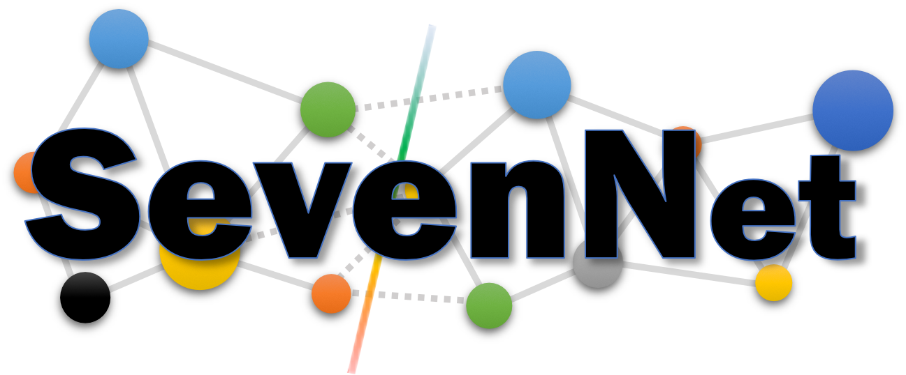

<p align="center">
  
</p>

# SevenNet

SevenNet (Scalable EquiVariance-Enabled Neural Network) is a graph neural network (GNN)-based interatomic potential package that supports parallel molecular dynamics simulations using [`LAMMPS`](https://lammps.org). Its core model is based on [`NequIP`](https://github.com/mir-group/nequip).

Full documentation, including **installation**, **usage**, and **pretrained models**, is available at [documentation](https://sevennet.readthedocs.io/en/latest/).

## Features
 - Pretrained GNN interatomic potential and fine-tuning interface
 - [Atomic Simulation Environment (ASE)](https://wiki.fysik.dtu.dk/ase/) calculator (python)
 - GPU-parallelized molecular dynamics with LAMMPS
 - CUDA-accelerated D3 (van der Waals) dispersion
 - Multi-fidelity training for combining multiple databases with different calculation settings
 - Fine-tuning with forgetting prevention (experience replay + Elastic Weight Consolidation) for continual learning
 - [Tensor product accelerators](https://sevennet.readthedocs.io/en/latest/user_guide/accelerator.html)


## Pretrained Models

SevenNet provides pretrained models (universal potentials).
Please refer to the documentation for available checkpoints, and usage examples: [Pretrained models](https://sevennet.readthedocs.io/en/latest/user_guide/pretrained.html)

## Installation and user guides

Installation (including LAMMPS and D3) and user guides can be found in our [documentation](https://sevennet.readthedocs.io/en/latest/).

The old README (prior to v0.12.0) can be found [here](./docs/old_readme/).

## Citation

If you use this code, please cite:
```bib
@article{park_scalable_2024,
	title = {Scalable Parallel Algorithm for Graph Neural Network Interatomic Potentials in Molecular Dynamics Simulations},
	volume = {20},
	doi = {10.1021/acs.jctc.4c00190},
	number = {11},
	journal = {J. Chem. Theory Comput.},
	author = {Park, Yutack and Kim, Jaesun and Hwang, Seungwoo and Han, Seungwu},
	year = {2024},
	pages = {4857--4868},
}
```

If you utilize the multi-fidelity feature of this code or the pretrained model SevenNet-MF-ompa, please cite the following paper:
```bib
@article{kim_sevennet_mf_2024,
	title = {Data-Efficient Multifidelity Training for High-Fidelity Machine Learning Interatomic Potentials},
	volume = {147},
	doi = {10.1021/jacs.4c14455},
	number = {1},
	journal = {J. Am. Chem. Soc.},
	author = {Kim, Jaesun and Kim, Jisu and Kim, Jaehoon and Lee, Jiho and Park, Yutack and Kang, Youngho and Han, Seungwu},
	year = {2024},
	pages = {1042--1054},
}
```

If you utilize the pretrained model SevenNet-Omni or multi-task training strategies including task-specific regularization and domain-bridging dataset, please cite the following paper:
```bib
@article{kim_optimizing_2025,
	title = {Optimizing Cross-Domain Transfer for Universal Machine Learning Interatomic Potentials},
	volume = {17},
	doi = {10.1038/s41467-026-70195-8},
	number = {3432},
	journal = {Nat. Commun.},
	author = {Kim, Jaesun and You, Jinmu and Park, Yutack and Lim, Yunsung and Kang, Yujin and Kim, Jisu and Jeon, Haekwan and Ju, Suyeon and Hong, Deokgi and Lee, Seung Yul and Choi, Saerom and Kim, Yongdeok and Lee, Jae W and Han, Seungwu},
	year = {2026},
}
```

If you utilize the pretrained model SevenNet-Nano, please cite the following paper:
```bib
@article{oh_lightweight_2026,
	title = {A Lightweight Universal Machine-Learning Interatomic Potential via Knowledge Distillation for Scalable Atomistic Simulations},
	doi = {10.1021/acs.jcim.6c01103},
	journal = {J. Chem. Inf. Model.},
	author = {Oh, Sangmin and You, Jinmu and Kim, Jaesun and Lee, Jiho and An, Hyungmin and Han, Seungwu and Kang, Youngho},
	year = {2026},
}
```

If you utilize the reEWC forgetting-aware fine-tuning strategy for continual learning of pretrained universal machine-learning interatomic potentials, please cite the following paper:
```bib
@article{kim_efficient_2026,
	title = {An Efficient Forgetting-Aware Fine-Tuning Framework for Pretrained Universal Machine-Learning Interatomic Potentials},
	volume = {12},
	doi = {10.1038/s41524-025-01895-w},
	number = {26},
	journal = {npj Comput. Mater.},
	author = {Kim, Jisu and Lee, Jiho and Oh, Sangmin and Park, Yutack and Hwang, Seungwoo and Han, Seungwu and Kang, Sungwoo and Kang, Youngho},
	year = {2026},
}
```
